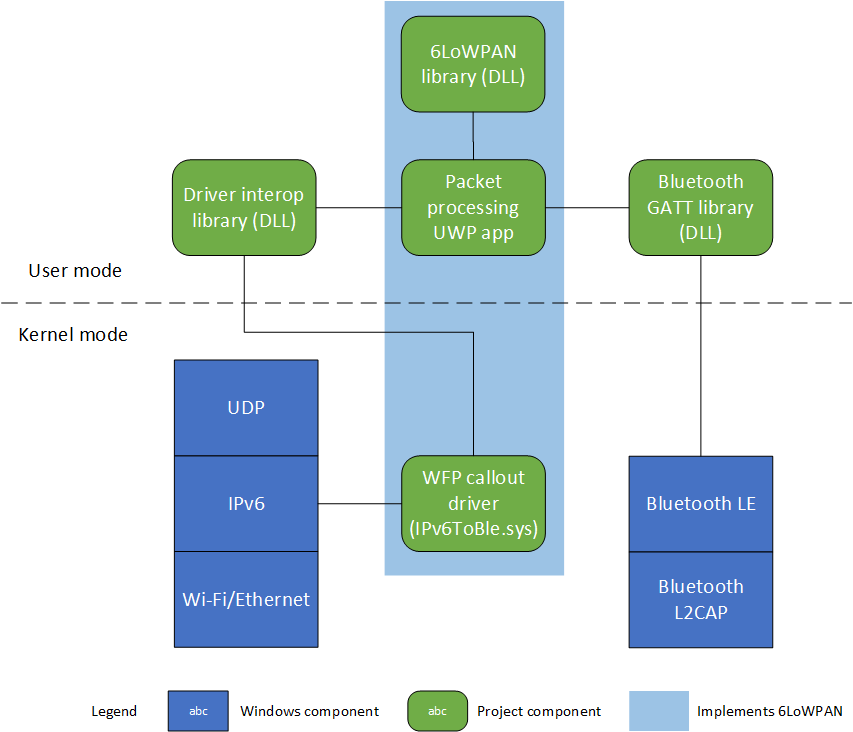

# IPv6OverBluetoothLowEnergyMesh

This project enables the transfer of IPv6 packets over a Bluetooth Low Energy Mesh of IoT devices.

TODO: Add more information about project as a whole

## Architecture

There are four components to this project:

1. WFP callout driver (IPv6ToBle.sys)
2. Packet processing app
3. 6LoWPAN header compression module
4. GUI device provisioning app

The following diagram illustrates the system architectue for this solution:

## System requirements

This project requires Windows 10. All components are Universal and will run on any Windows 10 SKU. The WFP callout driver is unique to Windows and does not translate directly to other platforms architecturally.

Porting this project to Linux is possible by removing the driver, then using socket programming in the usermode apps to perform send and receive operations.

## WFP callout driver

This Windows Filtering Platform callout driver acts as part of the bridge between the TCP/IP stack on Windows and the Bluetooth stack. The driver's binary is IPv6ToBle.sys.

Source code for this project is best viewed in Visual Studio, as line endings and indentation are sometimes thrown off by Git converting line endings if you view it in the browser.

For detailed information about this driver, see the ReadMe.txt in its directory.

### inf

This is the INF driver configuration file.

### sys

Source files for the driver.

### vs_project

The Visual Studio project for driver development.

## Packet processing app

TODO

## 6LoWPAN header compression module

TODO

## GUI device provisioning app

TODO